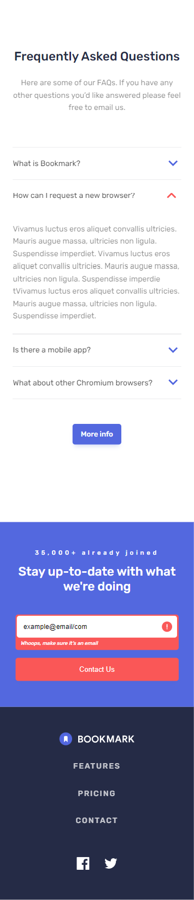

# Frontend Mentor - Bookmark landing page solution

This is a solution to the [Bookmark landing page challenge on Frontend Mentor](https://www.frontendmentor.io/challenges/bookmark-landing-page-5d0b588a9edda32581d29158). Frontend Mentor challenges help you improve your coding skills by building realistic projects.

## Table of contents

- [Overview](#overview)
  - [The challenge](#the-challenge)
  - [Screenshot](#screenshot)
- [My process](#my-process)
  - [Built with](#built-with)
  - [What I learned](#what-i-learned)
  - [Continued development](#continued-development)
- [Author](#author)

## Overview

Bookmark landing page solution, creating responsive Bookmark webpage.

### The challenge

Users should be able to:

- View the optimal layout for the site depending on their device's screen size
- See hover states for all interactive elements on the page
- Receive an error message when the newsletter form is submitted if:
  - The input field is empty
  - The email address is not formatted correctly

### Screenshot

## My process

- Mobile-first process, used custom css properties to dynamically change the font sizes, clrs, etc...!
- Used Javascript to create interactive navigation bar, my solution maynot be perfect but i think it's working, at least i gave it a try 🙂.

### Built with

- Semantic HTML5 markup
- CSS custom properties
- Flexbox
- Mobile-first workflow
- Vanilla Javascript

### What I learned

- Creating responsive and iteractive navigation bar, which was bit complicated.
- Creating the Accordion component.

### Continued development

- as usual, keep learning, and staying on the track with latest updates is the key.

## Author

#### DANIEL D

- Frontend Mentor - [@Korg01wfd](https://www.frontendmentor.io/profile/Korg01wfd)
